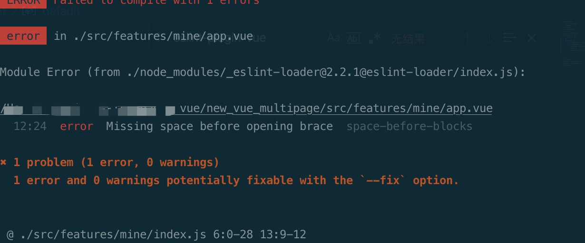

# 为你的前端团队添加规范

## 添加eslint

vue-cli3构建一个新项目,添加`.eslintrc.js`配置如下:

```js
module.exports = {
  root: true,
  parserOptions: {
    parser: 'babel-eslint',
    sourceType: 'module'
  },
  env: {
    browser: true
  },
  // https://github.com/standard/standard/blob/master/docs/RULES-en.md
  extends: [
    'plugin:vue/base'
  ],
  // required to lint *.vue files
  plugins: [
    'vue'
  ],
  // add your custom rules here
  'rules': {
    // allow paren-less arrow functions
    'indent': [2, 2], // 两个空格的缩进
    'quotes': [2, 'single'], // js必须使用单引号
    'linebreak-style': [2, 'unix'], // 换行风格 unix/windows
    'semi': [2, 'never'], // 语句强制分号结尾
    // 'no-console': [1], // 不允许console语句
    'no-unused-vars': [1], // 声明了变量但是没有使用检测
    'space-unary-ops': [1, { 'words': true, 'nonwords': false }], // 一元运算符的前/后要不要加空格
    'brace-style': [2, '1tbs', { 'allowSingleLine': false }], // 大括号风格
    'comma-spacing': [2, { 'before': false, 'after': true }],   // 逗号后有空格，前没有空格
    'comma-style': [2, 'last'],  // 逗号跟在结尾
    'key-spacing': [2, { 'beforeColon': false, 'afterColon': true }], // 对象字面量中冒号的前后空格
    'lines-around-comment': [ // 行前/行后备注
      2, {
        'beforeBlockComment': false, // 段注释的前后
        'beforeLineComment': false, // 行注释的前面
        'afterBlockComment': false, // 块注释的后面
        'afterLineComment': false, // 行注释的后面
        'allowBlockStart': true,
        'allowObjectStart': true,
        'allowArrayStart': true
      }],
    'max-depth': [2, 4], // 代码最多允许4层嵌套
    'max-len': [1, 1000, 2],
    'max-nested-callbacks': [2, 3], // 回调嵌套深度
    'max-params': [2, 5], // 函数最多只能有5个参数
    'max-statements': [1, 80],  // 单个函数最多80条语句
    'no-array-constructor': [2], // 禁止使用数组构造器
    'no-lonely-if': 2, // // 禁止else语句内只有if语句
    'no-multiple-empty-lines': [2, { 'max': 3, 'maxEOF': 1 }], // 空行最多不能超过2行
    'no-nested-ternary': 2,  // 不使用嵌套的三元表达式
    'no-spaced-func': 2, // 函数调用时 函数名与()之间不能有空格
    'no-trailing-spaces': 2, // 一行结束后面不要有空格
    'no-unneeded-ternary': 2, // 禁止不必要的嵌套 var isYes = answer === 1 ? true : false;简单的判断用三元表达式代替
    'object-curly-spacing': [2, 'always', { // 大括号内是否允许不必要的空格 always始终允许；never始终不允许
      'objectsInObjects': false,
      'arraysInObjects': false
    }],
    'arrow-spacing': 2, // =>的前/后括号
    'block-scoped-var': 2, // 块语句中使用var
    'no-dupe-class-members': 2,
    // 'no-var': 1, // 禁用var，用let和const代替
    'object-shorthand': [1, 'always'], // 强制对象字面量缩写语法
    'array-bracket-spacing': [2, 'never'], // 是否允许非空数组里面有多余的空格
    'operator-linebreak': [2, 'after'], // 换行时运算符在行尾还是行首
    // 'semi-spacing': [2, { 'before': false, 'after': false }], // 分号前后空格
    'keyword-spacing': ['error'],
    'space-before-blocks': 2, // 不以新行开始的块{前面要不要有空格
    'block-spacing': [2, 'always'],
    'space-before-function-paren': [2, 'never'], // 函数定义时括号前面要不要有空格
    'space-in-parens': [2, 'never'], // 小括号里面要不要有空格
    'spaced-comment': [1, 'always',
      {
        'exceptions': ['-', '*', '+']
      }], // 注释风格要不要有空格什么的
    'arrow-parens': 0,
    // allow async-await
    'generator-star-spacing': 0,
    // allow debugger during development
    'no-debugger': process.env.NODE_ENV === 'production' ? 2 : 0
  },
  globals: {
    '$': false,
    'jquery': false,
    'ActiveXObject': false,
    'arbor': true,
    'layer': false
  }
}


```

运行`npm run lint`会给出报错，运行`npm run serve`也会对项目进行eslint校验，无法通过校验就会报错


可以结合vscode的eslint插件快速修复无法通过验证的代码，首先下载插件，然后更改setting.json配置文件，具体如下:

```json
"eslint.validate": [
    "javascript",
    "javascriptreact",
    "vue-html"
],
"eslint.run": "onSave",
"editor.codeActionsOnSave": {
    "source.fixAll.eslint": true
}

```

配置完成之后重启vscode，在编辑代码的时候如果未符合eslint的校验，保存时会自动修复代码。

## 添加git hooks

前端团队开发中如果没有做正确的校验就提交了代码，拉取代码时会导致很多地方爆红不符合定制的开发规范，因此可以在提交代码时做些限制.在`git`提交代码时，会触发一些列的钩子函数，可以通过`husky`这个git hooks的工具来进行代码提交校验,需要先安装依赖包`cnpm i -D husky lint-staged @commitlint/config-conventional @commitlint/cli`.然后在package.json中添加如下代码:

```json
// package.json
"husky": {
  "hooks": {
    "pre-commit": "lint-staged",// 在pre-commit阶段运行下面配置的校验功能
    "commit-msg": "commitlint -E HUSKY_GIT_PARAMS" // 这个是规范提交的信息的，结合commitlint.config.js使用
  }
},
"lint-staged": {
  "src/**/*.{js,vue}": [
    "npm run lint",
    "git add ."
  ]
}

```

```js
// commitlint.config.js
// 参考的官方配置，提交的信息必须按照下面规范书写，类似`git commit -m 'feat: 添加eslint'`
module.exports = {
  // parserPreset: 'conventional-changelog-conventionalcommits',
  extends: ['@commitlint/config-conventional'],
  rules: {
    'body-leading-blank': [1, 'always'],
    'body-max-line-length': [2, 'always', 100],
    'footer-leading-blank': [1, 'always'],
    'footer-max-line-length': [2, 'always', 100],
    'header-max-length': [2, 'always', 100],
    'scope-case': [2, 'always', 'lower-case'],
    'subject-case': [
      2,
      'never',
      ['sentence-case', 'start-case', 'pascal-case', 'upper-case']
    ],
    'subject-empty': [2, 'never'],
    'subject-full-stop': [2, 'never', '.'],
    'type-case': [2, 'always', 'lower-case'],
    'type-empty': [2, 'never'],
    'type-enum': [
      2,
      'always',
      [
        'build',
        'chore',
        'ci',
        'docs',
        'feat',
        'fix',
        'perf',
        'refactor',
        'revert',
        'style',
        'test'
      ]
    ]
  }
}
```
